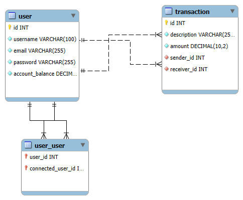

#PayMyBuddy

Application permettant à un utilisateur d'envoyer de l'argent à ses amis, de consulter ses transactions et de gérer ses contacts.

## Fonctionnalités principales

- Inscription et authentification via JWT
- Ajout d'amis par adresse email
- Transferts d'argent entre amis
- Historique des transactions
- Affichage du solde et recharge du compte
- Mise à jour du profil

## Technologies
### Backend
- Java 21
- SpringBoot 
- MySQL
- Maven

### Frontend
- Vue.js 2
- Node
- Axios

## Installation du projet
### 1. Cloner le projet
git clone https://github.com/MarionDernoncourt/PayMyBuddy.git

### 2.Initialisation de la base de donnée 
voir dossier Script SQL pour les scripts d'initialisation

### 3. Configuration des variables d'environnement 
Dans le fichier application.properties, configurer les variables suivantes : 

spring.datasource.username=${DB_USERNAME}
spring.datasource.password=${DB_PASSWORD}
jwt.secret=${JWT_SECRET_KEY}

## Lancement de l'application
### Backend
Ouvrir le projet backend
Clic droit sur la classe principale -> Sélectionner Run As > SpringBootApp

### Frontend
Depuis le dossier frontend : 
npm install
npm run serve

## Modèle Physique de Données (MPD)

